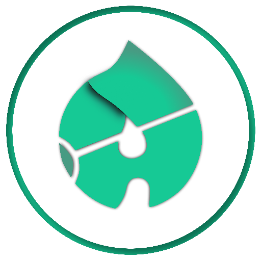

<p align="center">
  <a href="https://www.adazolhub.online">
    
    <h1 align="center">Adazolhub</h1>
  </a>
</p>

## Getting Started

First, run the development server:

```bash
npm run dev
# or
yarn dev
```

Open [http://localhost:3000](http://localhost:3000) with your browser to see the result.

Then, run the storybook:

```bash
npm run storybook
# or
yarn storybook
```
Open [http://localhost:6006](http://localhost:6006) with your browser to see the result.


## Learn More

Use Next Js framework with Storybook for designing components in development environment

 with Figma Design integrated on Storybook

### Guide on installing the storybook and integrating Figma to Storybook

Install storybook package

```bash
npx -p @storybook/cli sb init
```

Install storybook can be found in [https://storybook.js.org/addons](https://storybook.js.org/addons)

```bash
yarn add -D storybook-addon-designs
```

adding the code below under .storybook/main.js

```bash
  addons: [
    'storybook-addon-designs'
  ],
```

adding the parameters in storybook components (sample code below)

```bash
export default {
    title: 'ButtonTest',
    component: ButtonTest,
    argTypes: {
      backgroundColor: { control: 'color' },
      color: { control: 'color'}
    },
    decorators: [withDesign],
    parameters: {
      design: {
        type: 'figma',
        url: 'https://www.figma.com/file/3FV5TRPuacbMyhSWjMtNd2/Blog-posts?node-id=29%3A22'
     },
    }
  };
```


added card design | May 23, 2021


### Contributors

- Daniel Lozada
